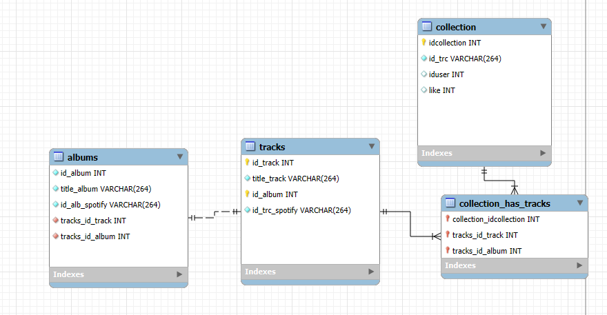

# Nicolas-Francois-backend

### Inscription et connexion
Grace a ce tuto \+ le cours

https://www.youtube.com/watch?v=BaEm2Qv14oU

### Le CRUD

> [!WARNING]  
> Le CRUD est présent dans le projet librairie et le projet d'axe. Je ne peux pas l'implémenter pour les cartes à cause des relations entre les tables ce qui donne pleins d'erreurs.

#### Crud de support
Il y a un crud de support (creation de ticket)
- voir les tickets dans la BDD et via la page help-admin.php
- supprimer et modifier des tickets via la page help-admin.php
- cree un ticket via la page help.php

#### CRUD de la librairie

### Shema de la BDD card (avec les relations)

